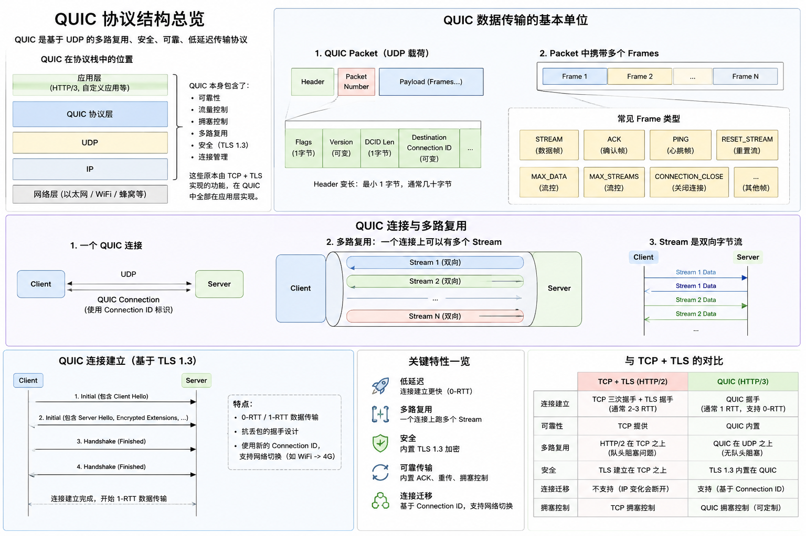

# srt-core 设计

`srt-core` 是 SRT 协议模型的中心 crate。

SRT 借鉴 QUIC 的 packet/frame 分层思想：**Packet 是传输单元，Frame 是 Packet payload 内的语义单元**。

参考图：



SRT 不实现 QUIC，也不使用 UDP。SRT 面向串口类字节流，所以还需要在后续设计中处理串口字节边界。但在协议模型中，`srt-core` 只关注 Packet 和 Protocol Frame。

## 核心分层

SRT 的核心协议分层：

```text
SRT Packet
├── Packet Header
├── Packet Number
└── Packet Payload
    ├── SRT Frame 1
    ├── SRT Frame 2
    └── SRT Frame N
```

串口传输时还需要外层 envelope：

```text
Serial Byte Stream
└── Serial Envelope / Wire Packet Boundary
    └── SRT Packet
```

`Serial Envelope` 负责 magic、length、crc、resync、半包、粘包等字节流问题。它不是 SRT Protocol Frame。

## 职责

`srt-core` 定义：

- `Packet`
- `PacketHeader`
- `PacketNumber`
- `PacketPayload`
- `PacketType`
- `Frame`
- `FrameKind`
- `MessageFrame`
- `AckFrame`
- `ChannelId`
- `MessageId`
- 协议基础常量和限制

`srt-core` 不实现：

- 串口驱动
- DMA 驱动
- 操作系统适配
- engine event loop
- ack 算法
- retransmit 算法
- sliding window 算法
- 串口 envelope 编解码

## Packet

`Packet` 是 SRT 的协议传输单元。

```rust
pub struct Packet<'a> {
    pub header: PacketHeader,
    pub payload: PacketPayload<'a>,
}
```

`PacketPayload` 在当前阶段使用 borrowed bytes 表示。这些 bytes 的语义是：**encoded SRT protocol frames**，不是单一用户 message。

## Packet Header

Packet header 采用紧凑设计，借鉴 QUIC 的 header bits 思路。

当前保留这些概念：

```text
PacketType
  区分 packet 形态。

Flags
  紧凑 bit 字段。

PacketNumber
  用于 ack、去重、重传。
```

`channel_id` 不属于 packet header。它属于 `MESSAGE Frame`。

## Frame

`Frame` 是 packet payload 内的语义单元。

初版 frame 类型：

```text
MESSAGE
  承载一段 message fragment。

ACK
  承载确认信息。
```

后续可以扩展：

```text
MAX_MESSAGES
HEARTBEAT
CANCEL_MESSAGE
CLOSE_CHANNEL
...
```

注意：SRT v1 不直接继承 QUIC 的 `PING` / `RESET_STREAM`。SRT 的第一公民是 message，不是通用 byte-stream。心跳、取消 message、关闭 channel 等能力后续应该按 SRT 自己的 message runtime 语义设计，而不是提前把 QUIC 对象搬进 core。

## Message-Oriented Channel

SRT channel 是 message-oriented，不是 TCP 式无限 byte-stream。

上层应用负责：

```text
protobuf / postcard / cbor / 自定义结构
  -> bytes
```

SRT 负责：

```text
message bytes
  -> 分片成 MESSAGE Frames
  -> 放入 Packet Payload
  -> 接收端重组成完整 message bytes
  -> 交付给上层
```

上层应用不需要自己处理 message length、半包、粘包或 fragment reassembly。

## MESSAGE Frame

`MessageFrame` 承载某个 channel 上的一段 message fragment。

```text
MessageFrame
├── channel_id
├── message_id
├── message_len
├── fragment_offset
├── flags
└── data
```

字段含义：

- `channel_id`：逻辑 channel。
- `message_id`：这个 channel 上的一条 message。
- `message_len`：完整 message 的总长度。
- `fragment_offset`：当前 fragment 在 message bytes 中的位置。
- `flags`：例如 first、last 等 fragment 语义。
- `data`：当前 fragment 的 bytes。

接收端根据：

```text
channel_id + message_id + message_len + fragment_offset
```

重组完整 message。

当已收到的 fragment 覆盖：

```text
[0, message_len)
```

就可以交付完整 message bytes。

## ChannelId

协议 wire format 必须携带 `channel_id`。否则接收端无法判断 message 属于哪个逻辑通道，也无法做 QoS、可靠性、重组和 engine 路由。

用户 API 可以不直接暴露 `channel_id`。

```text
低层 API
  send(channel_id, message_bytes)

高层 API
  send_control(message_bytes)
  send_telemetry(message_bytes)
  send_topic("imu", message_bytes)
```

高层 API 可以由 engine 做映射：

```text
channel / topic / actor
  -> channel_id
  -> MESSAGE frame
  -> Packet
```

## ChannelId 分配与双向通信

双向通信时，channel id 需要表达发起方和方向。可以借鉴 QUIC 的思想，在 channel id 的低 bits 中编码属性：

```text
ChannelId(u16)

bit 0: initiator
  0 = endpoint A initiated
  1 = endpoint B initiated

bit 1: direction
  0 = bidirectional
  1 = unidirectional

high bits: channel index
```

这只是方向，不是最终定稿。

嵌入式场景也可以支持静态划分：

```text
0..63
  reserved system channels

64..1023
  static application channels

1024..
  dynamic channels
```

固定 `ChannelId` 适合 MCU 固定协议、控制链路、遥测链路。动态 `ChannelId` 适合 actor/topic/engine 自动分配。

## 目录结构

`srt-core` 目录结构：

```text
srt-core/src/
├── lib.rs
├── packet.rs
├── frame.rs
├── packet/
│   ├── header.rs
│   ├── number.rs
│   ├── payload.rs
│   └── ty.rs
└── frame/
    ├── kind.rs
    ├── channel.rs
    └── ack.rs
```

`lib.rs` 只做模块声明和 re-export。

## 核心原则

```text
Packet 是传输单元。
Frame 是 packet payload 内的语义单元。
MESSAGE Frame 承载 message fragment。
Channel 是逻辑通道。
SRT 保留 message 边界。
串口 envelope 是字节流边界，不是 protocol frame。
```
